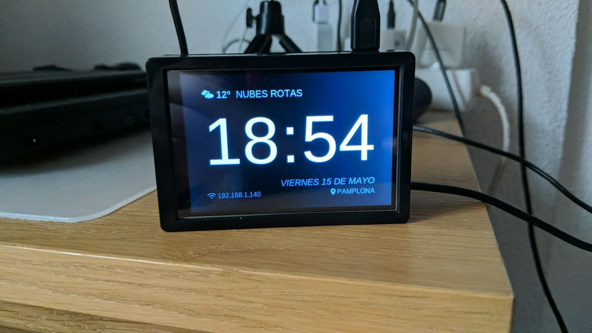

# Raspberry Pi Clock
This project is a simple Raspberry Pi clock app with wheather and IP information.



## LCD Panel installation
Please refer to your lcd installation process for more detail. For my panel to work I needed to follow this steps on a fresh Raspbian Lite (buster) image:

```bash
git clone https://github.com/goodtft/LCD-show.git
chmod -R 755 LCD-show
cd LCD-show/
sudo ./MHS35-show [orientation]
```
_In my case the orientation that works is 180º_

> Go to lcdwiki for more information: https://github.com/lcdwiki/LCD-show

## Software installation
A fresh copy of Rasbpian Lite is prefered.
```bash
sudo apt install freeglut3-dev
git clone https://github.com/hkfuertes/rpi_display
cd rpi_display
pip3 install -r requirements.txt
./create.desktop.sh
cp Clock.desktop /home/pi/Desktop
```
For auto run on startup:
```bash
mkdir -p /home/pi/.config/lxsession/LXDE-pi/
echo "@$(pwd)/app.py" >> /home/pi/.config/lxsession/LXDE-pi/autostart
```

### Information
When running a `current.pid`  file is created with the running pid. If you need to kill it you can do:
 ```bash
kill -9 $(cat path/to/rpi_display/folder/current.pid)
```

## TODO
- Read config.yml
  - Export OWM key to config.yml
- Weahter forecast (free?)
- Disable screensaver
- Control brightness with python